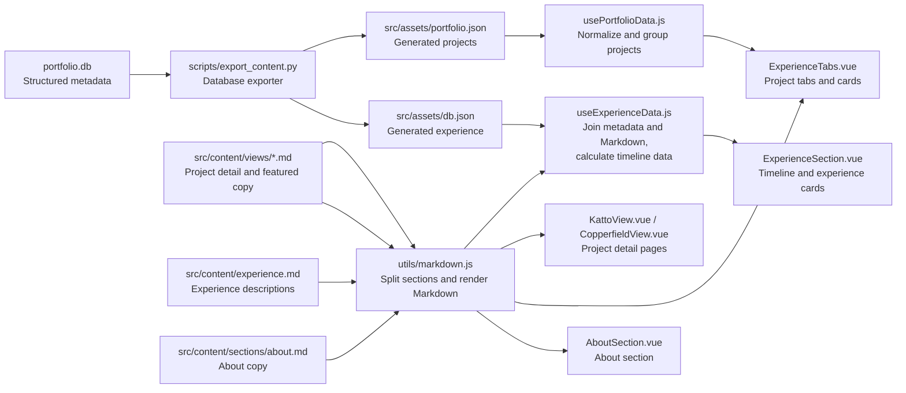
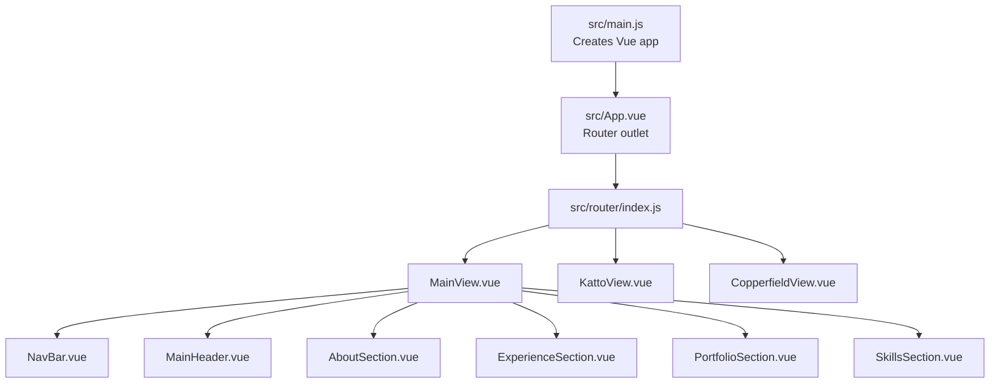

# Project Quick Reference

Use this document to find the right file when returning to the portfolio after
time away.

## Architecture

The JSON files are generated output. Edit `portfolio.db`, then run
`npm run export:content` or `npm run build`.

## Where To Make Changes

| I want to... | Edit | Also check |
| --- | --- | --- |
| Add or edit a project | `portfolio.db`, table `PortfolioCards` | Put its image/download in `public/`, then regenerate JSON |
| Change project categories | `portfolio.db`, column `type` | Allowed values are `game`, `tool`, and `app` |
| Feature, unfeature, or reorder projects | `portfolio.db`, column `highlightOrder` | Use `NULL` for normal projects or a unique positive number for featured order |
| Change Katto featured copy | `src/content/views/katto.md` | Edit its optional `section:highlight` section |
| Change Copperfield featured copy | `src/content/views/copperfield.md` | Edit its optional `section:highlight` section |
| Change the Katto detail page text | `src/content/views/katto.md` | Section placement and images are in `KattoView.vue` |
| Change the Copperfield detail page text | `src/content/views/copperfield.md` | Section placement is in `CopperfieldView.vue` |
| Add a project detail page | Add a slug-named Markdown file and a view | Register a route whose name matches the project slug |
| Add or edit experience metadata | `portfolio.db`, table `experience` | Use a unique semantic `slug`, then regenerate JSON |
| Change an experience description | `src/content/experience.md` | Its marker must be `section:experience-<database-slug>` |
| Change the About text | `src/content/sections/about.md` | Rendering lives in `AboutSection.vue` |
| Change skills | `src/components/Sections/SkillsSection.vue` | Card rendering lives in `Cards/SkillsCard.vue` and `Cards/SkillsList.vue` |
| Change personal/header links | `src/components/Headers/MainHeader.vue` | Link markup lives in `src/components/Snippets/HeaderLink.vue` |
| Change section navigation | `src/components/Headers/NavBar.vue` | Section IDs are declared by the section components |
| Add or change a route | `src/router/index.js` | The route renders a file under `src/views/` |
| Change global colors or typography | `src/assets/css/index.css` | Global element styles also exist in `App.vue` |
| Change legacy/template styling | `src/assets/css/vscardTemplate.css` | Search for the class before editing |
| Add an image, GIF, or download | `public/` | Reference it from the database or a view with a root path such as `/image.png` |
| Change Markdown behavior | `src/utils/markdown.js` | `MarkdownContent.vue` controls rendered-content styling |
| Change database export behavior | `scripts/export_content.py` | Never hand-edit the generated JSON files |
| Change build or dependencies | `package.json` | Vite configuration lives in `vite.config.js` |

## Page Composition

## File Responsibilities

### Content and data

| File | Responsibility |
| --- | --- |
| `portfolio.db` | Source of truth for project and experience metadata |
| `scripts/export_content.py` | Converts SQLite tables into frontend JSON |
| `src/assets/portfolio.json` | Generated project metadata; do not edit directly |
| `src/assets/db.json` | Generated experience metadata; do not edit directly |
| `src/content/experience.md` | All timeline descriptions, keyed by experience slug |
| `src/content/views/katto.md` | Katto detail narrative and optional featured-card copy |
| `src/content/views/copperfield.md` | Copperfield detail narrative and optional featured-card copy |
| `src/content/sections/about.md` | About section narrative |
| `public/` | Files served directly: project images, GIFs, and downloads |

### Data logic

| File | Responsibility |
| --- | --- |
| `src/composables/usePortfolioData.js` | Normalizes project data, filters visible projects, groups by type, orders featured projects, and looks up projects by slug |
| `src/composables/useExperienceData.js` | Joins experience metadata to Markdown by slug, groups roles, and calculates timeline positions |
| `src/utils/markdown.js` | Parses named Markdown sections and renders the supported Markdown subset |

### Views and sections

| File | Responsibility |
| --- | --- |
| `src/views/MainView.vue` | Composes the portfolio home page |
| `src/views/KattoView.vue` | Defines the layout, images, and Markdown sections on the Katto page |
| `src/views/CopperfieldView.vue` | Defines the layout and Markdown sections on the Copperfield page |
| `src/components/Sections/AboutSection.vue` | Renders About Markdown |
| `src/components/Sections/ExperienceSection.vue` | Renders the horizontal timeline and grouped experience lists |
| `src/components/Sections/PortfolioSection.vue` | Hosts project tabs |
| `src/components/Sections/SkillsSection.vue` | Owns the skills content and layout |

### Reusable UI

| File or folder | Responsibility |
| --- | --- |
| `src/components/Cards/` | Project, experience, and skill card presentation |
| `src/components/Containers/ExperienceTabs.vue` | Featured projects and project category tabs |
| `src/components/Containers/ExperienceGroup.vue` | One grouped list of experience cards |
| `src/components/TabsSystem/` | Reusable tab state and tab panels |
| `src/components/layouts/SectionLayout.vue` | Shared home/detail section wrapper |
| `src/components/layouts/DetailLayout.vue` | Detail-page hero/header wrapper |
| `src/components/MarkdownContent.vue` | Converts Markdown source to HTML and styles it |
| `src/components/HorizontalTimeLine.vue` | Desktop timeline visualization |
| `src/components/Headers/` | Header, sidebar, warning, and navigation UI |

### Tooling and root files

| File | Responsibility |
| --- | --- |
| `src/main.js` | Creates Vue, registers Font Awesome and the router, and imports global CSS/Bootstrap |
| `src/App.vue` | Root router outlet and a small set of global element styles |
| `src/router/index.js` | Maps URLs to Vue views and controls route scrolling |
| `package.json` | Dependencies and development, export, build, preview, and lint commands |
| `vite.config.js` | Vite configuration and the `@` alias for `src/` |
| `index.html` | HTML entry point and site metadata |
| `CNAME` | GitHub Pages custom domain |
| `deploy-gh-pages.sh` | macOS/Linux GitHub Pages deployment helper |
| `deploy-gh-paged.bat` | Windows GitHub Pages deployment helper |
| `AGENTS.md` | Naming, formatting, and content conventions for future code changes |
| `PORTFOLIO_REPO_REPORT.md` | Longer architecture, risk, and maintenance report |

### Currently disconnected files

These files are not imported by the active application. Check whether they are
still needed before building new work on top of them.

| File | Current status |
| --- | --- |
| `src/components/Containers/OuterFrame.vue` | Not referenced |
| `src/components/layouts/SidebarLayout.vue` | Not referenced; its only purpose is to host `Sidebar.vue` |
| `src/components/Headers/Sidebar.vue` | Only referenced by the unused `SidebarLayout.vue` |
| `src/components/Headers/OnlineWarning.vue` | Not referenced |
| `src/assets/css/vscardTemplate.css` | Not imported by the application |
| `Texts.MD` | Not read by the application |

## Content Workflow

1. Edit structured metadata in `portfolio.db` using Beekeeper Studio.
2. Edit narrative text in the relevant file under `src/content/`.
3. Add referenced media or downloads under `public/`.
4. Run `npm run build`.
5. Confirm the generated JSON diff contains the intended metadata changes.

Featured projects are controlled entirely by `highlightOrder` in `portfolio.db`.
Featured copy is optional and comes from `section:highlight` in the slug-named
project Markdown file. A detail link appears when a route with that slug exists.

For naming and formatting conventions, see `AGENTS.md`. For the longer
architecture and maintenance review, see `PORTFOLIO_REPO_REPORT.md`.
